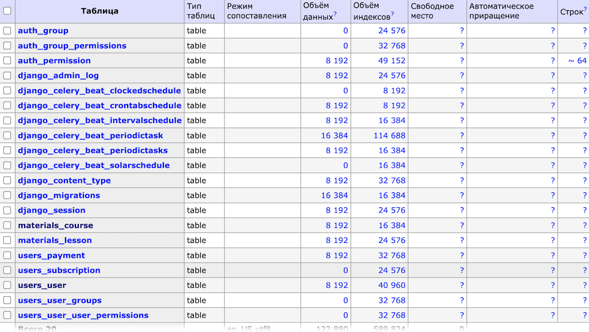
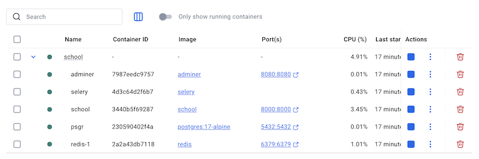

# Домашняя работа к модулю 9

# Тема 34.2 Docker Compose

## 1. Структура и описание сервисов

Весь проект разбит на 5 сервисов (контейнеров):

### -- postgres - сервис базы данных PostgreSQL.

Контейнер с БД. Используется готовый образ postgres:17-alpine.

### -- adminer - сервис интерфейса администрирования базы данных.

Используется готовый образ adminer.

После запуска сервиса, Adminer доступен по адресу: http://localhost:8080



Параметры входа в Adminer:

-- server: psgr

-- db_user: school_admin

-- db_password: 1234

-- db_name: school

### -- redis - сервис базы данных Redis.

Используется готовый образ redis:latest.

### -- web - сервис веб-сервера (django).

Образ создаётся с помощью Dockerfile. Фикстура для заполнения БД находятся в корне проекта в файле "all_data.json".

Применение фикстур:

```bash
docker-compose exec web python manage.py loaddata /app/all_data.json
```

### -- celery - сервис Celery, используется для запуска периодических задач.

Образ создаётся с помощью Dockerfile.


## 2. Запуск Docker Compose локально

```bash
docker compose up --build
```

Результат работы:




## 3. Проверка работоспособности сервисов

Для каждого сервиса прописан healthcheck.

-- test: Команда, которая будет выполняться для проверки состояния контейнера. Используются стандартные утилиты (pg_isready, redis-cli ping, curl).

-- interval: Интервал между проверками. Указывается в секундах.

-- retries: Количество неудачных попыток перед тем, как контейнер будет считаться непригодным.

-- start_period: Время ожидания перед началом проверок после запуска контейнера.

-- timeout: Максимальное время, которое дается на выполнение команды проверки.

Docker будет проверять каждый сервис с заданным интервалом и выполнять проверки на основе указанных команд. Если сервис не отвечает, он будет помечен как "неработающий".

## 3. Описание дополнительных решений

Для работы контейнера с Celery нужно создать тот же самый образ, что и для web-контейнера. Это очень хорошо видно по их размеру. При запуске контейнера celery возникла проблема - для запуска нужно применить миграции и запустить celery-beat. Но если сделдать это командой:

```bash -c "python manage.py migrate && celery -A config worker --loglevel=info"``` в секции command,

то возникает ошибка: миграции не успевают примениться и уже происходит запуск celery-beat. Чтобы исправить эту проблему, пришлось создать дополнительный файл entrypoint_celery.sh, который проверяет готовность базы данных, применяет миграции и запускает celery-beat. Для работы entrypoint_celery.sh в Dockerfile добавлена установка netcat и 
entrypoint_celery.sh делается исполняемым. 

Точно таким же способом и с той же целью создан исполняемый файл entrypoint_web.sh, который проверяет готовность базы данных, применяет миграции и запускает веб-сервер в контейнере web.

Для исключения загрузки в контейнеры фалов с кэшами и прочей вспомоготельной информацией создан файл .dockerignore.


## 4. Известные проблемы

При запуске swaggera происходит ошибка в ручке пользователя, конкретно в методе get_serializer_class. Причина известна: 
Когда DRF строит схемы для Swagger/Redoc, он вызывает get_serializer_class() не во время реального запроса, а на этапе подготовки документации. Именно в этот момент у self.request и self.get_object() ещё нет реальных данных. А в коде у меня написано:

```python
def get_serializer_class(self):
        if self.action in ["retrieve", "update", "partial_update"]:
            if self.request.user == self.get_object():
                ...
```
Я так понимаю, что нужно переписать get_serializer_class() без вызова self.get_object(). А отличать "свой профиль" от "чужого" в сериализаторе. Но для этого нужно сделать много рефакторинга и пока не понимаю как.
